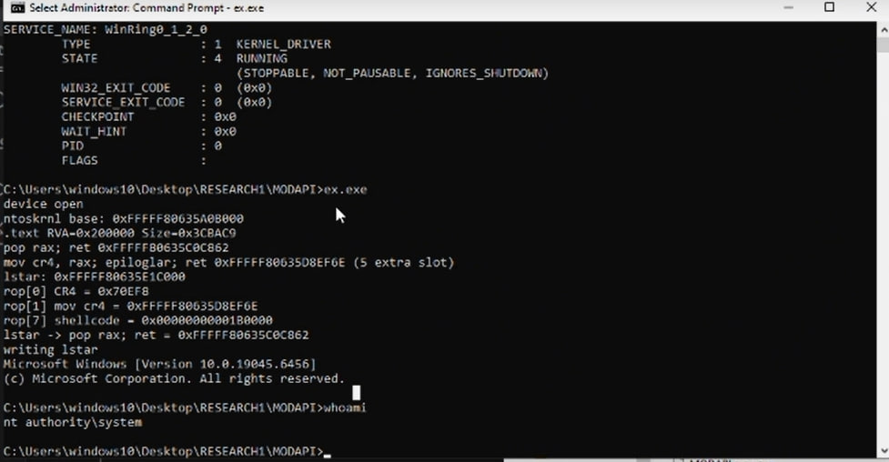

hi hackers.

This one is an unauthenticated MSR write inside MODAPI.sys, the kernel driver that MSI Dragon Center 2.0.155.0 installs. The driver exposes a device object with a security descriptor that lets any local user open it, no admin and no UAC. Once you have the handle there is no whitelist on the MSR index, so you can read and write whatever MSR you like.

The read side already breaks KASLR by itself. Read IA32_LSTAR (0xC0000082) and the driver hands you ntoskrnl!KiSystemCall64 for free. The write side is the real problem. IA32_LSTAR is the address the CPU jumps to on syscall, and the driver lets a normal user overwrite it. Point it at code you control and the next syscall runs your code at CPL0. SMEP is the only thing in the way, so the exploit reads IA32_LSTAR first to find ntoskrnl, parses the image from disk, finds a couple of gadgets to clear SMEP with mov cr4, rax, runs a small shellcode that copies the SYSTEM token into the current process, and restores IA32_LSTAR on the way out so the machine keeps working.

I tested this on Windows 10 x64 22H2 (build 19045.6456) from a standard user account. There is no race and no heap grooming, it worked every time I ran it. The driver comes with Dragon Center on MSI machines, so it is already loaded on a lot of systems. Build it with gcc -O2 -o poc.exe poc.c -lpsapi and run it as a normal user. It was reported to MSI on 2026-06-21 and the fix has been verified.

11bd2c9f9e2397c9a16e0990e4ed2cf0679498fe0fd418a3dfdac60b5c160ee5  MODAPI.sys

